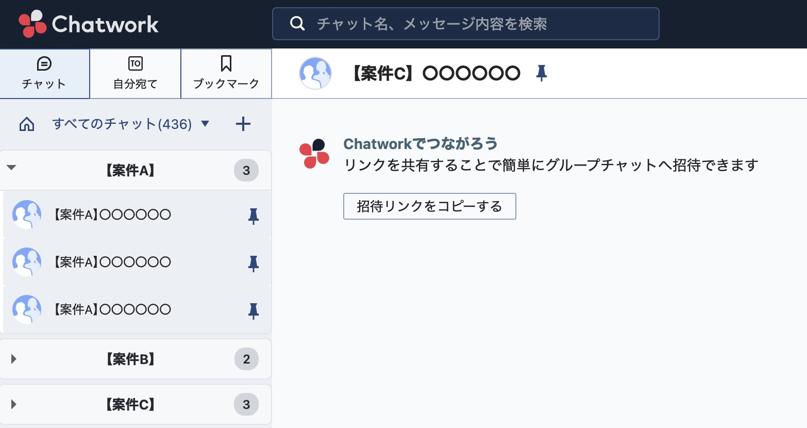

# Chatwork Groupy

煩雑になりがちなChatworkのチャットリストを、キーワードに基づいて自動でグループ化し、すっきりと整理するためのChrome拡張機能です。

**この拡張機能は、制作者から共有された特定のユーザーのみが利用できる非公開版です。**

---

## ✨ 主な機能

- **キーワードに基づく自動グループ化:** 「社内」「A案件」などのキーワードで関連チャットを自動でまとめます。
- **快適なアコーディオンUI:** グループをクリックするだけで、関連チャットをスムーズに開閉できます。
- **複数キーワード対応:** 一つのグループに「A案件, B案件, 連絡」のように、複数のキーワードをカンマ区切りで設定可能です。
- **ルールの簡単管理:** ポップアップ画面から、グループ化ルールの追加・編集・削除が直感的に行えます。
- **リアルタイム反映:** ルールの追加や変更は、Chatworkの画面に即座に反映されます。
- **グループの並び順カスタマイズ:** ルール一覧をドラッグ＆ドロップで並び替え、その順序通りにグループが表示されます。
- **グループごとの背景色カスタマイズ:** 各グループの背景色を自由に設定できます。
- **グループ開閉状態の自動復元:** グループを開いたままにしても、通知増減や再描画時に開閉状態が維持されます。
- **安定動作・CSP対応:** Chatwork本体の動作や大量チャット環境でも安定して動作します。

## 🚀 インストールと使い方

#### インストール

1.  制作者から共有された**Chromeウェブストアのリンク**を開きます。
2.  ページ右上に表示される**「Chromeに追加」**ボタンをクリックします。
3.  確認のポップアップが表示されたら、「拡張機能を追加」をクリックすれば完了です。

#### 使い方

1.  インストール後、ブラウザのツールバーに表示される**アイコン（フォルダと吹き出しのマーク）**をクリックして、設定画面を開きます。
2.  「グループ名」と「キーワード」を入力し、**「ルールを追加」**ボタンを押します。
    -   キーワードを複数設定したい場合は、カンマ（`,`）で区切って入力してください。
3.  ルールを追加すると、Chatworkの画面が自動的に更新され、グループ化が適用されます。
4.  グループの並び順を変更したい場合は、ルール一覧をドラッグ＆ドロップしてください。順序通りにグループが表示されます。
5.  各グループの背景色はカラーピッカーで自由に設定できます。
4.  作成したルールは、いつでも編集・削除が可能です。

## 📝 注意事項

-   Chatwork本体のUIや仕様が変更された場合、拡張機能が正常に動作しなくなる可能性があります。その際は、制作者にご連絡ください。
-   グループ化の設定は、お使いのブラウザに安全に保存され、外部に送信されることはありません。

---

### 開発者向け情報

この拡張機能を改修・開発する場合は、以下の手順で環境をセットアップしてください。

1.  このリポジトリを `git clone` するか、ZIPファイルでダウンロードします。
2.  Chromeブラウザで `chrome://extensions/` を開きます。
3.  「デベロッパーモード」をオンにし、「パッケージ化されていない拡張機能を読み込む」から、このプロジェクトのフォルダを選択します。

#### 主な技術スタック

-   JavaScript (ES6+)
-   HTML5 / CSS3
-   Chrome Extension API (Manifest V3)

---

## 📜 ライセンス

このプロジェクトはMITライセンスの下で公開されています。

Copyright (c) 2025 Koya Morishita

##  更新履歴

-   **v1.0**
    -   初回リリース
-   **v2.0** (2025-06-13)
    -   ルールの編集機能を追加
    -   複数キーワードでのグループ化に対応
    -   ルール変更時のリアルタイム反映機能を追加
    -   UI/UXの大幅な改善
-   **v3.0** (2025-06-19)
    -   グループの並び順カスタマイズ機能を追加（ドラッグ＆ドロップ対応）
    -   グループごとの背景色カスタマイズ機能を追加
    -   グループ開閉状態の自動復元に対応
    -   安定動作化・CSP対応・エラー対策
    -   UI/UXのさらなる改善
-   **v3.1** (2025-06-20)
    -   グループ削除時のリストマーカー表示問題を修正
    -   未読バッジとToマークの表示を改善
    -   レイアウトの安定性を向上